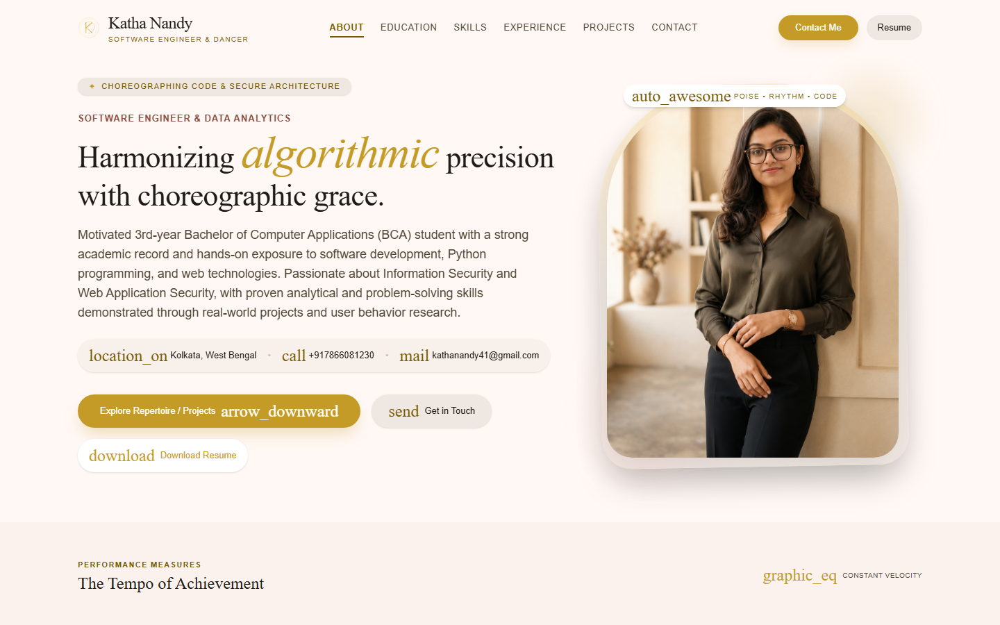
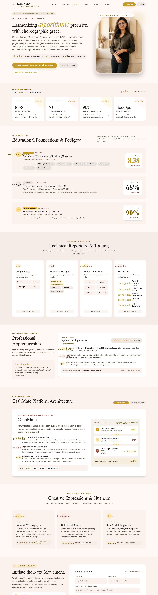

# KATHA-NANDY-POL

### Choreographed Portfolio of Katha Nandy — Software Engineer & Classical Dancer



A **dance-themed, visually elegant portfolio website** that blends choreographic grace with software engineering precision. Built with React 19, Tailwind CSS v4, and Vite — this portfolio showcases the unique identity of **Katha Nandy**, a BCA student from Brainware University, Kolkata, specializing in **Software Development**, **Information Security**, and **Web Application Security**.

---

## Live Preview

**Portfolio:** [kathanandy.dev](https://kathanandy.dev/)

---

## Screenshots

### Contact & Creative Expressions


---

## Features

- **Animated Loading Screen** — Custom SVG logo with smooth circular progress bar
- **Fairy Lights Background** — Decorative ambient light particles in the Hero section
- **Scroll-Triggered Reveal Animations** — Intersection Observer-based fade, slide, zoom transitions
- **Responsive Navigation** — Sticky header with active section tracking and mobile hamburger menu
- **Image Protection** — Right-click, drag, copy, and keyboard shortcut prevention on profile image
- **Spam-Proof Contact Form** — Honeypot field, rate limiting, input sanitization, and email validation
- **Material Symbols Icons** — Google Material Design icon set throughout
- **SEO Optimized** — Full meta tags, Open Graph, Twitter Cards, JSON-LD structured data, canonical URL
- **Security Headers** — Content-Security-Policy, X-Content-Type-Options built into HTML
- **Lighthouse-Friendly** — Optimized fonts, preloaded assets, lazy loading, minimal JS bundle
- **Dark-on-Light Design** — Warm material design color palette with gold accent primary tones

---

## Sections

| Section | Description |
|---------|-------------|
| **Hero** | Profile image, tagline, contact info, CTA buttons |
| **Metrics** | Key performance numbers (GPA, apps deployed, security focus) |
| **Education** | BCA (8.38 CGPA), Higher Secondary, Secondary with curriculum tags |
| **Skills** | Programming, Security, Tools & Soft Skills in 4-card grid |
| **Experience** | Python Developer Intern at InternPe (Jun–Jul 2025) |
| **Projects** | CashMate Platform Architecture — financial tracking system |
| **Creative Expressions** | Dance, Behavioral Research, Arts & Multilingualism |
| **Contact** | Email, Phone, Location cards + contact form |
| **Footer** | Brand, social links, copyright |

---

## Tech Stack

| Technology | Usage |
|-----------|-------|
| **React 19** | UI components, hooks, state management |
| **Vite 8** | Build tool, dev server, HMR |
| **Tailwind CSS v4** | Utility-first styling via Vite plugin |
| **OxLint** | Fast JavaScript/JSX linting |
| **JavaScript (ESM)** | All application logic |
| **Material Symbols** | Google icon font |

---

## Project Structure

```
KATHA-NANDY-POL/
├── public/
│   ├── favicon.svg          # Custom SVG favicon
│   ├── icons.svg            # SVG sprite
│   ├── img.png              # Profile photo
│   ├── robots.txt           # Search engine rules
│   └── sitemap.xml          # XML sitemap
├── src/
│   ├── App.jsx              # Root component with loading state
│   ├── App.css              # Global styles
│   ├── main.jsx             # React entry point
│   ├── index.css            # Tailwind + custom CSS
│   ├── assets/
│   │   ├── hero.png         # Hero image asset
│   │   ├── react.svg        # React logo
│   │   └── vite.svg         # Vite logo
│   ├── components/
│   │   ├── Loading.jsx      # Animated loading screen
│   │   ├── SecurityGuard.jsx# Security utilities
│   │   ├── Header.jsx       # Sticky nav with mobile menu
│   │   ├── Hero.jsx         # Hero section with profile
│   │   ├── Metrics.jsx      # Achievement metrics cards
│   │   ├── Education.jsx    # Education timeline
│   │   ├── Skills.jsx       # Technical skills grid
│   │   ├── Experience.jsx   # Work experience
│   │   ├── Projects.jsx     # Featured project showcase
│   │   ├── CreativeExpressions.jsx # Dance & arts section
│   │   ├── Contact.jsx      # Contact form & info
│   │   ├── Footer.jsx       # Site footer
│   │   ├── FairyLights.jsx  # Ambient particle effects
│   │   └── Reveal.jsx       # Scroll animation wrapper
│   └── utils/
│       └── contact.js       # Contact info (encoded)
├── index.html               # HTML with meta, SEO, JSON-LD
├── package.json             # Dependencies & scripts
├── vite.config.js           # Vite + Tailwind config
└── .oxlintrc.json           # Linter config
```

---

## Getting Started

### Prerequisites

- **Node.js** >= 18
- **npm** >= 9

### Installation

```bash
git clone https://github.com/RAZERBOY786/KATHA-NANDY-POL.git
cd KATHA-NANDY-POL
npm install
```

### Development

```bash
npm run dev
```

Opens at [http://localhost:5173](http://localhost:5173)

### Build for Production

```bash
npm run build
```

Output in `dist/` directory.

### Preview Production Build

```bash
npm run preview
```

### Lint

```bash
npm run lint
```

---

## Key Component Highlights

### `Reveal.jsx` — Scroll Animation Engine
Custom Intersection Observer hook that triggers `fade`, `up`, `down`, `left`, `right`, and `zoom` animations as elements enter the viewport. Supports configurable delay and duration.

### `FairyLights.jsx` — Ambient Particles
Decorative floating light particles rendered on the Hero section for a warm, choreographic atmosphere.

### `Contact.jsx` — Secure Contact Form
- **Honeypot protection** — Hidden field catches bots
- **Rate limiting** — 30-second cooldown via sessionStorage
- **Input sanitization** — HTML stripping, XSS prevention
- **Email validation** — Regex-based format checking

### `Header.jsx` — Smart Navigation
- Intersection Observer tracks active section
- Scroll-aware background blur
- Smooth scroll with header offset compensation
- Mobile-responsive with click-outside-to-close

---

## Design Philosophy

> *"Structured modular design is like choreography: every subroutine must enter with intention, sustain its balance, and exit seamlessly."* — **Katha Nandy**

This portfolio embodies the fusion of **dance and code** — where the discipline of tala (rhythm), mudra (gesture), and stage coordination directly informs clean software architecture. Every animation, every color choice, and every interaction is choreographed with intention.

---

## Color Palette

| Token | Description |
|-------|-------------|
| `primary-container` | Warm gold (#C59B27 range) — CTAs, accents |
| `surface` | Soft warm white (#FFF8F5) — backgrounds |
| `on-surface` | Deep brown-black — primary text |
| `secondary` | Deep amber — secondary accents |
| `primary-fixed` | Light gold tint — card backgrounds, badges |

---

## Author

**Katha Nandy**
- BCA (Honours) — Brainware University, Kolkata
- CGPA: 8.38 / 10.0
- Specialization: Software Engineering, Web App Security, Python Development
- Location: Kolkata, West Bengal, India

### Connect

- [LinkedIn](https://www.linkedin.com/in/katha-nandy-94a8a6367/)
- [GitHub](https://github.com/kathanandy)

---

## License

This project is personal portfolio work. All rights reserved by Katha Nandy.

---

<p align="center">
  
  
  
</p>

<p align="center">
  <em>Poise · Rhythm · Code</em>
</p>
